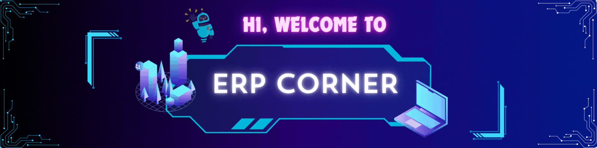

<!--Banner-->


<hr>

<p align="center">
    
</p>

<p align="right"> 
    
</p>

🚀 **ERP Corner** is the IT division of our company, dedicated to building innovative and scalable ERP (Enterprise Resource Planning) solutions tailored to enhance business processes and efficiency.

We specialize in:
- **ERP System Development**: Developing and customizing ERP systems that streamline business operations, improve workflow, and optimize supply chains.
- **Microservices Architecture**: Adopting modular, scalable, and independent services that allow businesses to grow without compromising system performance.
- **Data-Driven Solutions**: Leveraging data analytics and machine learning to enable smarter business decisions and predictive insights.
- **Integration with Industry Standards**: Ensuring seamless integration with third-party systems like CRM, finance, inventory, and more.

## 💡 Our Mission
At **ERP Corner**, we strive to **bridge the gap between technology and business needs**, delivering robust and flexible solutions that empower organizations to achieve operational excellence.

## 📈 Our Goals
1. **Improve Efficiency**: Through custom ERP development, we aim to improve the efficiency of internal processes.
2. **Enhance Collaboration**: Providing tools that promote better communication and collaboration across departments.
3. **Drive Innovation**: Continuously innovating to meet the evolving needs of modern businesses.

## 🛠️ What We Do
- 🖥️ **Custom ERP Development**
- ⚙️ **System Integration & Automation**
- 📊 **Data Analytics & Reporting**
- 🔒 **Security & Compliance**
- 🏗️ **Microservices & Cloud Solutions**

## 🤝 Collaboration and Open Source
We believe in the power of collaboration. Many of our projects are open-source, and we encourage the community to contribute and collaborate with us. Together, we can build cutting-edge ERP solutions for the future!

## 🌐 Connect With Us
- [Website](https://yourwebsite.com)
- [LinkedIn](https://www.linkedin.com/company/erp-corner)
- [Twitter](https://twitter.com/erp_corner)

---

Thank you for visiting **ERP Corner**! We are excited to work on innovative projects that shape the future of business technology. Let’s build something great together! 💼✨


Here’s an enhanced version of the material you requested to be added to the bottom of your README:

---

## 🛠️ **Git Collaboration Guide for ERP Corner**  
This document is designed to streamline collaboration for the ERP Corner development team, ensuring efficient Git practices for optimal project management.

### 🔀 **Branching Strategy**  
At ERP Corner, we use a structured Git branching system to maintain code quality and enable seamless teamwork.

- **Main Branch**  
  Holds the production-ready version of the application. Changes here are tested and approved for end-users.  

- **Dev Branch**  
  A staging area where features are tested by the team. It’s one step before reaching the main branch.

- **Dev Authors Branch**  
  Used by individual developers or teams working on specific features. This branch is where active development occurs.

---

### 📜 **Common Git Commands**

#### **Staging Changes**  
Prepare changes for the next commit:
```bash
git add .
```

#### **Committing Changes**  
Save your staged changes with a descriptive message:
```bash
git commit -m "commit message"
```

#### **Pushing Updates**  
Upload changes to the remote repository:
```bash
git push
```

#### **Pulling Updates**  
Download changes from the remote repository:
```bash
git pull
```

#### **Pulling a Specific Branch**  
Sync your local branch with updates from a specific branch:
```bash
git pull origin branch
```

#### **Merging Branches**  
Combine changes from another branch:
```bash
git merge branch_name
```

---

### 🌿 **Branch Management**

#### **Listing Branches**  
See all branches in your repository:
```bash
git branch
```

#### **Switching Branches**  
Move between branches:
```bash
git checkout branch_name
```

#### **Creating a New Branch**  
Start a new branch for development:
```bash
git checkout -b new_branch_name
```

---

### ✍️ **Rewriting History**

#### **Rebasing Branch**  
Rebase your branch with the latest changes from another branch:
```bash
git rebase branch_name
```

#### **Resetting to a Commit**  
Undo changes back to a specific commit:
```bash
git reset commit_hash
```

---

### 📘 **Naming Conventions**

To keep our Git history clear and organized, we follow these guidelines:

#### **Branch Names**  
- **Base Branches**: `main`, `dev`  
- **Sub Branches**: `dev_authors`

#### **Commit Messages**

Use the following structure for commit messages:
```
<type>(<module>): <description>
```
- **Type**: Describes the type of change.  
  - `feat`: New feature or enhancement.  
  - `fix`: Bug fixes or corrections.
  
- **Module**: The module affected by the changes (e.g., `sales`, `warehouse`, `master`).

- **Description**: A brief summary of the change made.

**Example**:
- `feat(sales): create CRUD menu interface`  
- `fix(master): update serializer to match model`

---

We hope these guidelines enhance collaboration and make using Git more efficient for everyone. Let's continue building amazing ERP solutions together! 🚀✨

---
