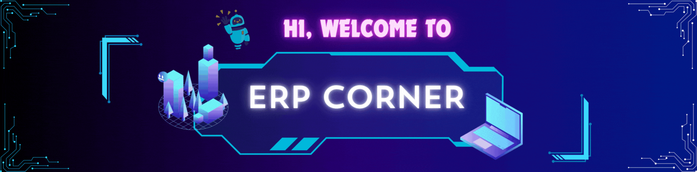

<!--Banner-->

    

 
    

🚀 **ERP Corner** is the IT division of our company, dedicated to building innovative and scalable ERP (Enterprise Resource Planning) solutions tailored to enhance business processes and efficiency.

We specialize in:
- **ERP System Development**: Developing and customizing ERP systems that streamline business operations, improve workflow, and optimize supply chains.
- **Microservices Architecture**: Adopting modular, scalable, and independent services that allow businesses to grow without compromising system performance.
- **Data-Driven Solutions**: Leveraging data analytics and machine learning to enable smarter business decisions and predictive insights.
- **Integration with Industry Standards**: Ensuring seamless integration with third-party systems like CRM, finance, inventory, and more.

## 💡 Our Mission
At **ERP Corner**, we strive to **bridge the gap between technology and business needs**, delivering robust and flexible solutions that empower organizations to achieve operational excellence.

## 📈 Our Goals
1. **Improve Efficiency**: Through custom ERP development, we aim to improve the efficiency of internal processes.
2. **Enhance Collaboration**: Providing tools that promote better communication and collaboration across departments.
3. **Drive Innovation**: Continuously innovating to meet the evolving needs of modern businesses.

## 🛠️ What We Do
- 🖥️ **Custom ERP Development**
- ⚙️ **System Integration & Automation**
- 📊 **Data Analytics & Reporting**
- 🔒 **Security & Compliance**
- 🏗️ **Microservices & Cloud Solutions**

## 🤝 Collaboration and Open Source
We believe in the power of collaboration. Many of our projects are open-source, and we encourage the community to contribute and collaborate with us. Together, we can build cutting-edge ERP solutions for the future!

## 🌐 Connect With Us
- [Website](https://yourwebsite.com)
- [LinkedIn](https://www.linkedin.com/company/erp-corner)
- [Twitter](https://twitter.com/erp_corner)

---

Thank you for visiting **ERP Corner**! We are excited to work on innovative projects that shape the future of business technology. Let’s build something great together! 💼✨

